# CockroachDB Installer Flow Diagrams

## 1. Overview Architecture

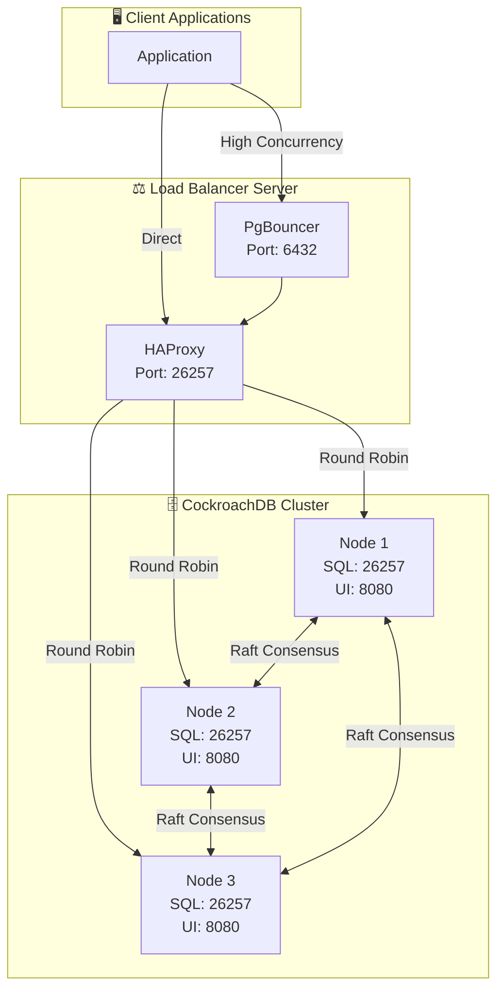

## 2. Complete Installation Flow

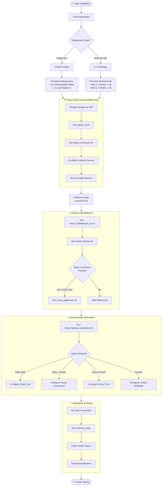

## 3. OS Optimization Flow (setup_os.sh)

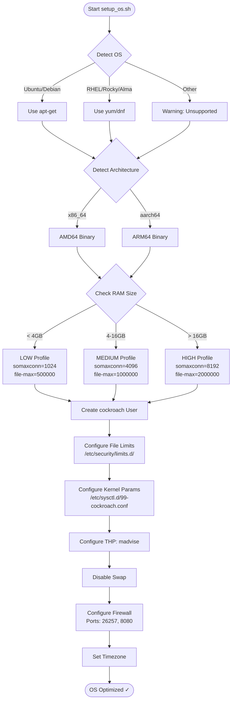

## 4. CockroachDB Installation Flow (setup_cockroach.sh)

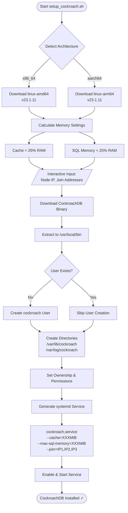

## 5. HAProxy Setup Flow (setup_haproxy.sh)

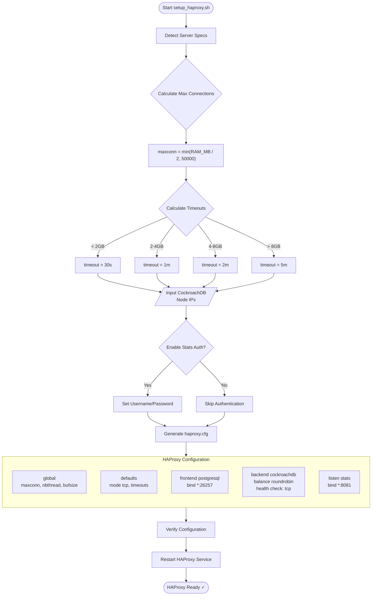

## 6. PgBouncer Setup Flow (setup_pgbouncer.sh)

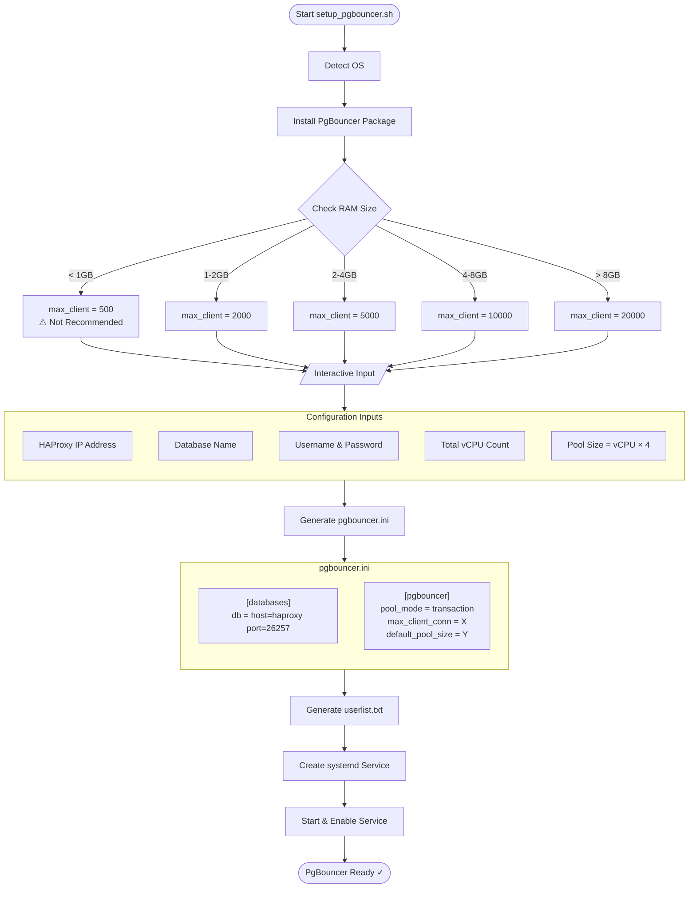

## 7. Backup & Restore Flow

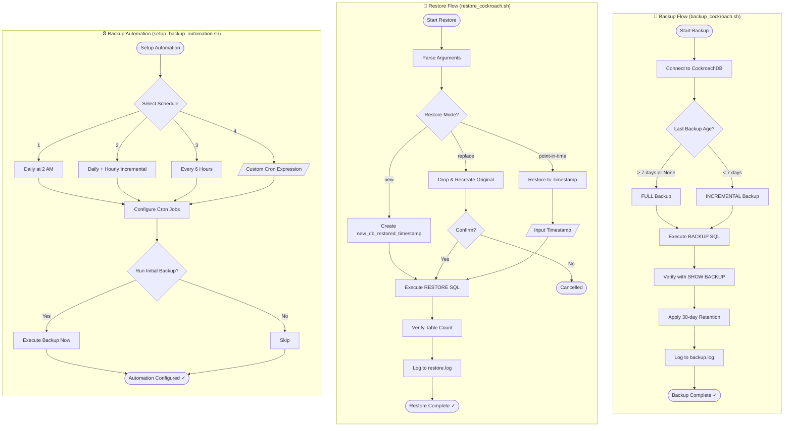

## 8. Multi-Site DR Architecture (2+3 Topology)

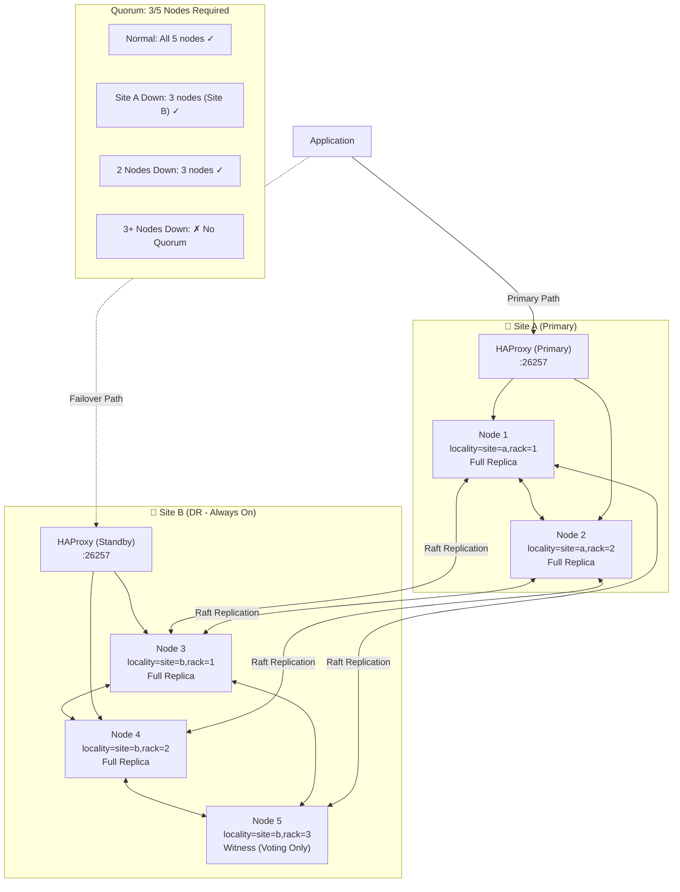

## 8.1 Multi-Site Deployment Flow (2+3 Topology)

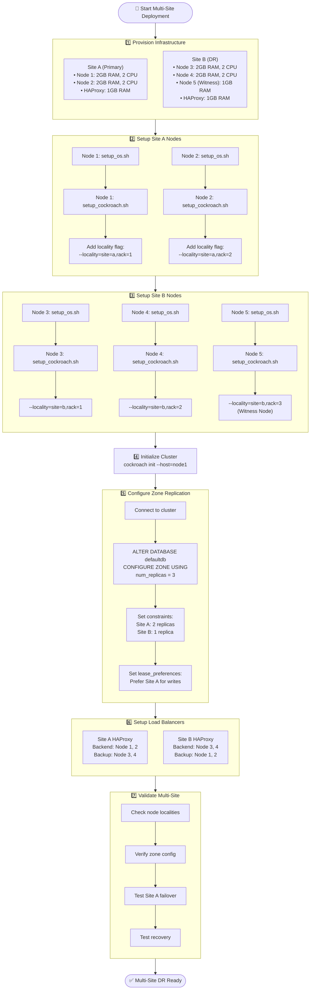

## 8.2 Zone Configuration Flow

```mermaid
flowchart TD
    Start([Configure Zone Replication]) --> Connect["Connect to CockroachDB<br/>cockroach sql --host=node1"]

    Connect --> CheckLocality["Verify Node Localities<br/>SELECT node_id, locality FROM crdb_internal.gossip_nodes"]

    CheckLocality --> HasLocality{All nodes have<br/>locality set?}
    HasLocality -->|No| FixLocality["Fix: Add --locality flag<br/>to systemd service"]
    HasLocality -->|Yes| ConfigDB

    FixLocality --> RestartNodes["Restart affected nodes"]
    RestartNodes --> CheckLocality

    subgraph ConfigDB["Configure Database Zone"]
        direction TB
        DB1["ALTER DATABASE defaultdb<br/>CONFIGURE ZONE USING"]
        DB1 --> DB2["num_replicas = 3"]
        DB2 --> DB3["constraints = '{<br/>  \"+site=a\": 2,<br/>  \"+site=b\": 1<br/>}'"]
        DB3 --> DB4["lease_preferences = '[[+site=a]]'"]
    end

    ConfigDB --> VerifyZone["SHOW ZONE CONFIGURATION<br/>FOR DATABASE defaultdb"]
    VerifyZone --> CheckRanges["Check range distribution<br/>SHOW RANGES FROM DATABASE"]

    CheckRanges --> Balanced{Replicas<br/>balanced?}
    Balanced -->|No| Wait["Wait for rebalancing<br/>(may take minutes)"]
    Balanced -->|Yes| End([Zone Configuration Complete ✓])
    Wait --> CheckRanges
```

## 8.3 Failover Scenarios

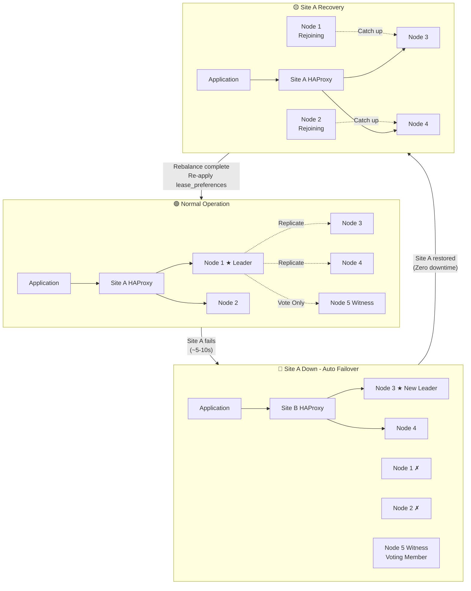

## 8.4 Failover Timeline

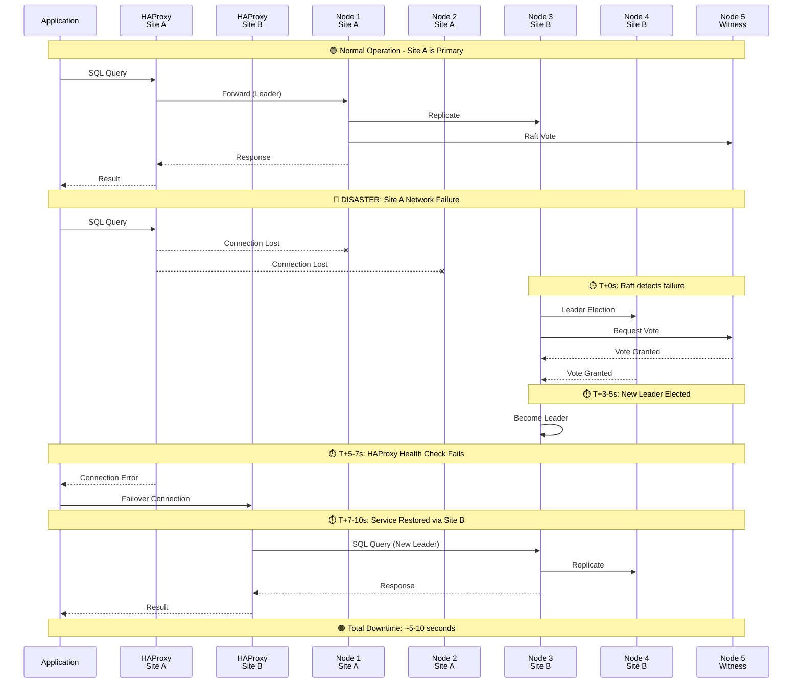

## 8.5 Multi-Site HAProxy Configuration

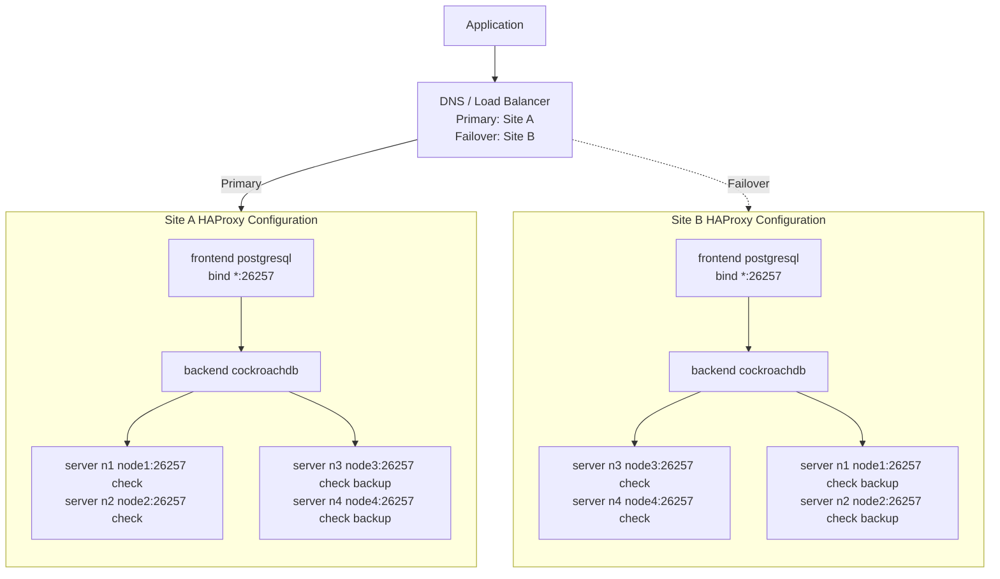

## 8.6 Witness Node Role

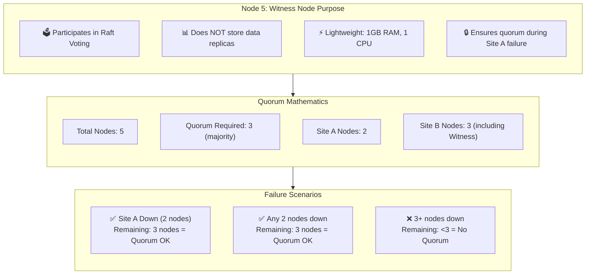

## 8.7 Data Replication Flow

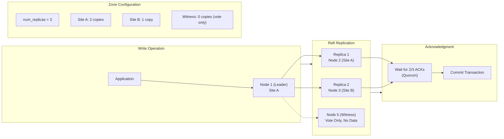

## 8.8 Multi-Site Script Support Status

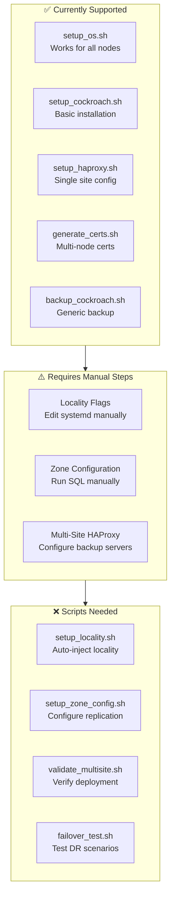

## 9. Connection Flow Detail

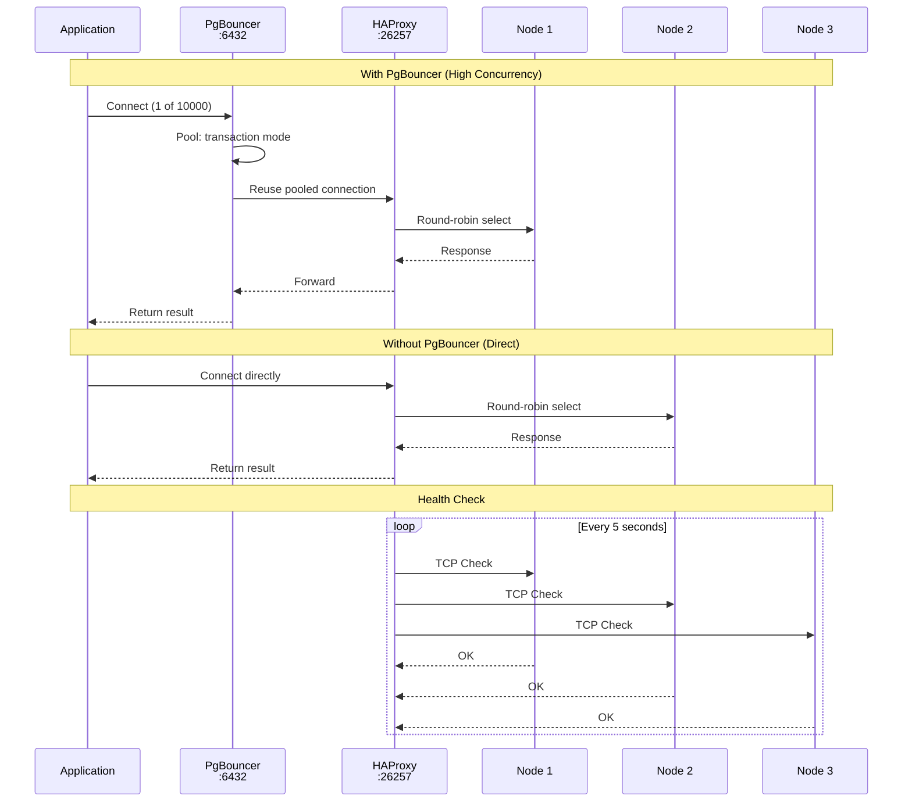

## 10. Script Dependencies & Execution Order

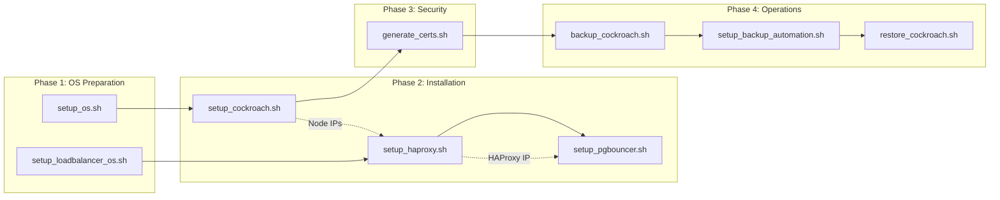

## 11. Decision Tree: When to Use Each Component

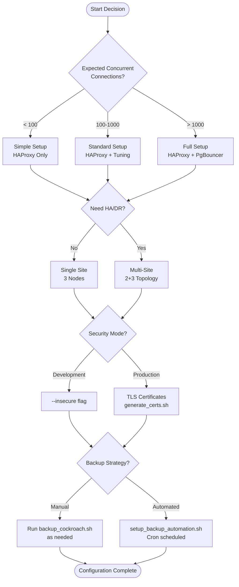

## 12. Memory-Based Configuration Matrix

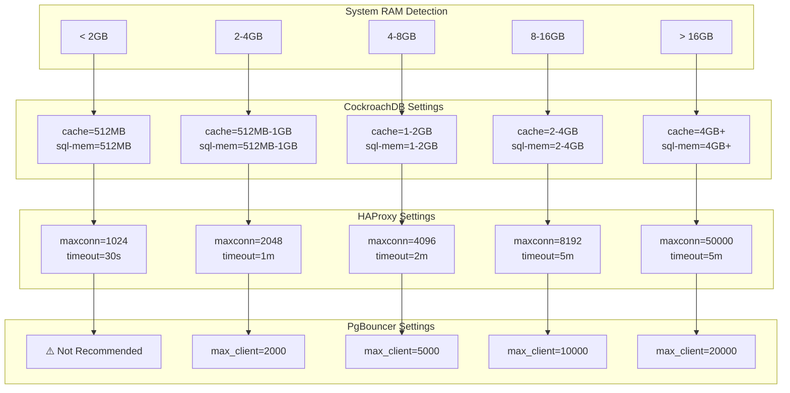

---

## Quick Reference: Script Purposes

| Script | Purpose | Run On |
|--------|---------|--------|
| `setup_os.sh` | OS optimization for CockroachDB nodes | Each DB Node |
| `setup_loadbalancer_os.sh` | OS optimization for load balancer | LB Server |
| `setup_cockroach.sh` | Install CockroachDB binary & service | Each DB Node |
| `setup_haproxy.sh` | Install & configure HAProxy | LB Server |
| `setup_pgbouncer.sh` | Install & configure PgBouncer | LB Server |
| `generate_certs.sh` | Generate TLS certificates | Any Node |
| `backup_cockroach.sh` | Manual/automated backup | Any Node |
| `restore_cockroach.sh` | Restore from backup | Any Node |
| `setup_backup_automation.sh` | Configure cron for backups | Backup Node |
